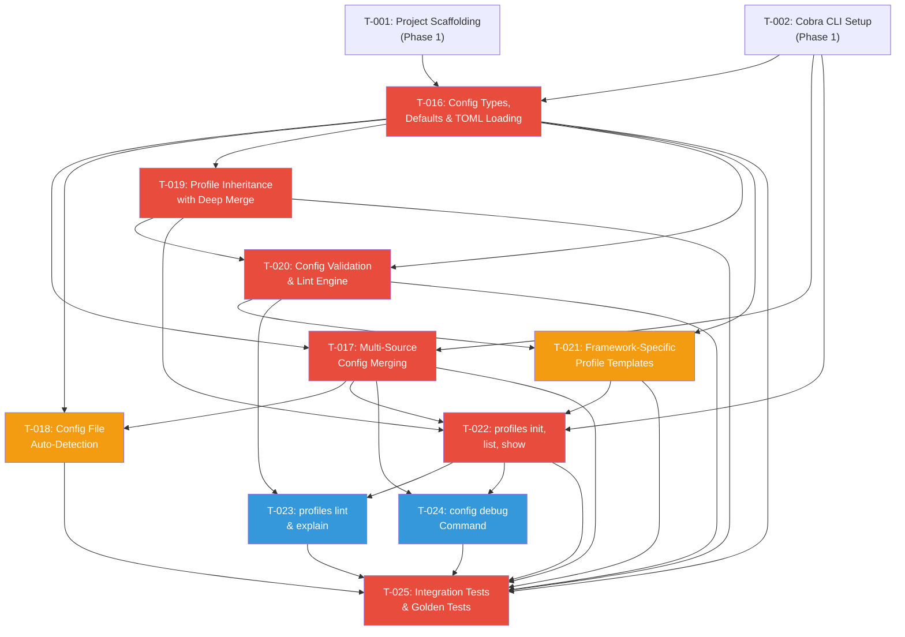

# Phase 2: Intelligence (Profiles) -- Task Index

## Overview

Phase 2 implements the Harvx profile system as defined in PRD Section 5.2. This is the configuration and profile engine that allows developers to define project-specific context strategies with relevance tiers, priority files, custom ignores, output settings, and LLM target presets. The profile system is what differentiates Harvx from simpler context-building tools.

**Total Tasks:** 10 (T-016 through T-025)
**Estimated Total Effort:** 72-102 person-hours (~9-13 person-days)
**Critical Path Length:** 6 tasks (T-016 -> T-017 -> T-019 -> T-020 -> T-022 -> T-025)

## Task Summary

| ID    | Title                                       | Priority    | Effort          | Dependencies         | Status |
|-------|---------------------------------------------|-------------|-----------------|----------------------|--------|
| T-016 | Config Types, Defaults, and TOML Loading    | Must Have   | Medium (8-12h)  | T-001, T-002         | --     |
| T-017 | Multi-Source Config Merging and Resolution   | Must Have   | Large (14-20h)  | T-016, T-002         | --     |
| T-018 | Config File Auto-Detection and Discovery     | Must Have   | Small (3-5h)    | T-016, T-017         | --     |
| T-019 | Profile Inheritance with Deep Merge          | Must Have   | Medium (8-12h)  | T-016, T-017         | --     |
| T-020 | Config Validation and Lint Engine            | Must Have   | Medium (8-12h)  | T-016, T-019         | --     |
| T-021 | Framework-Specific Profile Templates         | Must Have   | Medium (6-10h)  | T-016, T-020         | --     |
| T-022 | Profile CLI -- init, list, show              | Must Have   | Medium (8-12h)  | T-002, T-017, T-019, T-021 | -- |
| T-023 | Profile CLI -- lint and explain              | Should Have | Medium (8-12h)  | T-020, T-022         | --     |
| T-024 | Config Debug Command                         | Should Have | Small (4-6h)    | T-017, T-022         | --     |
| T-025 | Profile Integration Tests and Golden Tests   | Must Have   | Medium (8-12h)  | T-016 through T-024  | --     |

## Dependency Graph

**Legend:** Red = Critical Path | Orange = Must Have (parallel) | Blue = Should Have

## Suggested Implementation Order

### Week 1: Foundation (Days 1-3)

- [ ] **T-016:** Config Types, Defaults, and TOML Loading
  - Start here. All other tasks depend on this.
  - Define all Go structs, toml tags, and the default profile.

- [ ] **T-017:** Multi-Source Config Merging and Resolution
  - Start once T-016 types are defined.
  - Integrate koanf v2 with providers for TOML files, env vars, and CLI flags.

- [ ] **T-018:** Config File Auto-Detection and Discovery *(can be parallel with T-019)*
  - Small task. Implement directory traversal for harvx.toml discovery.

- [ ] **T-019:** Profile Inheritance with Deep Merge *(can be parallel with T-018)*
  - Implement the `extends` field resolution with cycle detection.

### Week 2: Validation and Templates (Days 4-6)

- [ ] **T-020:** Config Validation and Lint Engine
  - Depends on T-019 (needs inheritance to validate extends chains).
  - Validates all config fields, detects pattern overlaps.

- [ ] **T-021:** Framework-Specific Profile Templates
  - Create all 5+1 TOML template files with embedded Go.
  - Can start in parallel with T-020 (only needs T-016 types to validate).

### Week 3: CLI Commands and Testing (Days 7-10)

- [ ] **T-022:** Profile CLI -- init, list, show
  - Wire everything together into Cobra subcommands.
  - This is where users first interact with the profile system.

- [ ] **T-023:** Profile CLI -- lint and explain *(can be parallel with T-024)*
  - Diagnostic commands. Depends on validation engine.

- [ ] **T-024:** Config Debug Command *(can be parallel with T-023)*
  - Small task. Shows resolved config with source annotations.

- [ ] **T-025:** Profile Integration Tests and Golden Tests
  - Final task. Comprehensive end-to-end testing.
  - Creates test fixtures, golden files, fuzz tests, and benchmarks.

## Technical Stack Summary

| Package/Library          | Version | Purpose                          | Decision Rationale                   |
|--------------------------|---------|----------------------------------|--------------------------------------|
| github.com/BurntSushi/toml | v1.5.0  | TOML parsing and encoding       | Standard Go TOML library, TOML v1.0 spec |
| github.com/knadh/koanf/v2  | v2.x    | Multi-source config merging     | 313% smaller binary than Viper, cleaner abstractions |
| github.com/spf13/cobra     | v1.8.x  | CLI framework and subcommands   | Industry standard (kubectl, gh, docker) |
| github.com/bmatcuk/doublestar | v4.x | Glob pattern matching/validation | Doublestar glob support for relevance tiers |
| log/slog (stdlib)           | Go 1.22+ | Structured logging for warnings | Zero-dependency, built into Go         |
| text/tabwriter (stdlib)     | Go 1.22+ | Aligned table output            | Zero-dependency, built into Go         |

## Research Findings

### koanf vs Viper Decision

The PRD suggests evaluating `koanf/koanf` as a lighter alternative to Viper. Based on research:

- **koanf v2 binary is 313% smaller** than Viper (per koanf wiki benchmarks)
- koanf decouples providers (file, env, flags) into separate packages -- only import what you use
- koanf does not force-lowercase config keys (Viper does, breaking TOML/YAML spec)
- koanf supports the same merge semantics needed: load multiple sources, each overriding the previous
- **Recommendation: Use koanf v2** -- aligns with Harvx's goal of a small, single binary

### BurntSushi/toml Status

- v1.5.0 is latest stable, supports full TOML v1.0 specification
- `MetaData.Undecoded()` provides unknown-key detection (useful for forward compatibility warnings)
- The encoder (`toml.NewEncoder`) supports writing config back to TOML (needed for `profiles show`)

### Profile Inheritance Deep Merge

- The PRD explicitly states "arrays are replaced (not concatenated)" -- this is unusual and must be carefully implemented
- Manual field-by-field merging is recommended over reflection-based libraries like `mergo` for this reason
- Nested struct merging (e.g., RedactionConfig) should be field-by-field, not whole-struct replacement

## Phase 1 Dependencies

These Phase 1 tasks must be completed before Phase 2 can begin:

| Phase 1 Task | What Phase 2 Needs From It |
|---|---|
| T-001: Project Scaffolding | Go module, directory structure, Makefile |
| T-002: Cobra CLI Setup | Root command, flag registration, subcommand infrastructure |

The file discovery module (T-005 in Phase 1) is referenced by T-023 (`profiles explain`) but is not a hard blocker -- explain can work with theoretical file matching without actual filesystem discovery.
