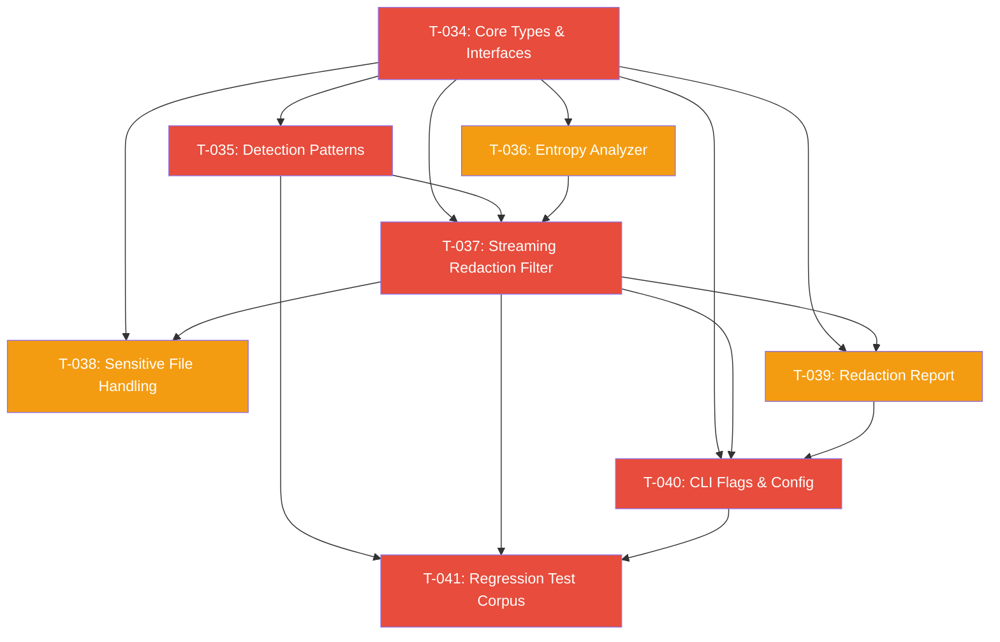

# Phase 4: Security -- Secret Detection & Redaction Pipeline

## Overview

This phase implements Harvx's primary security mechanism: automatic detection and redaction of secrets and credentials before they appear in LLM context output. The redaction pipeline is modeled after the Gitleaks ruleset with Harvx-specific enhancements including entropy analysis, path-based exclusions, confidence thresholds, custom patterns, and CI enforcement via `--fail-on-redaction`.

Redaction is **enabled by default** and sits between file reading and token counting in the processing pipeline. Content is redacted before it is counted, compressed, or rendered.

**PRD Sections Covered:** 5.5 (Secret & Credential Redaction), 7.1 (Secret Redaction), 7.3 (Sensitive File Handling), 9.1 (Unit Tests), 9.4 (Fuzz Tests)

**Total Tasks:** 8 (T-034 through T-041)
**Estimated Total Effort:** 60-96 person-hours (~8-12 person-days)
**Critical Path Length:** 5 tasks (T-034 -> T-035 -> T-037 -> T-040 -> T-041)

## Task Summary

| ID    | Title                                              | Priority  | Effort          | Dependencies       | Status |
|-------|----------------------------------------------------|-----------|-----------------|--------------------|--------|
| T-034 | Redaction Core Types, Interfaces, and Pattern Registry | Must Have | Medium (6-8hrs) | None               | Pending |
| T-035 | Gitleaks-Inspired Secret Detection Patterns        | Must Have | Large (14-20hrs)| T-034              | Pending |
| T-036 | Shannon Entropy Analyzer                           | Must Have | Medium (6-10hrs)| T-034              | Pending |
| T-037 | Streaming Redaction Filter Pipeline                | Must Have | Large (14-20hrs)| T-034, T-035, T-036| Pending |
| T-038 | Sensitive File Default Exclusions                  | Must Have | Small (4-6hrs)  | T-034, T-037       | Pending |
| T-039 | Redaction Report and Output Summary                | Must Have | Medium (6-10hrs)| T-034, T-037       | Pending |
| T-040 | CLI Redaction Flags and Profile Configuration      | Must Have | Medium (6-10hrs)| T-034, T-037, T-039| Pending |
| T-041 | Regression Test Corpus and Fuzz Testing            | Must Have | Medium (8-12hrs)| T-035, T-037, T-040| Pending |

## Dependency Graph

Red = critical path | Orange = parallelizable off critical path

## Suggested Implementation Order

### Week 1: Foundation (Days 1-3)

Start with the core types and the two independent analysis modules (patterns and entropy) which can be developed in parallel.

- [ ] **T-034**: Redaction Core Types, Interfaces, and Pattern Registry (Day 1)
  - Foundation for everything else. Must be completed first.
- [ ] **T-035**: Gitleaks-Inspired Detection Patterns (Days 1-3, starts after T-034)
  - Largest task. Can begin as soon as T-034 types are defined.
  - Develop patterns category by category: AWS -> GitHub -> Stripe -> ... 
- [ ] **T-036**: Shannon Entropy Analyzer (Day 2, parallel with T-035)
  - Independent module. Only depends on T-034 types, not patterns.
  - Can be developed entirely in parallel with T-035.

### Week 2: Core Engine + Integration (Days 4-7)

Build the streaming filter, then wire it into the CLI and pipeline.

- [ ] **T-037**: Streaming Redaction Filter Pipeline (Days 4-5)
  - Central engine. Requires T-034, T-035, T-036 to be complete.
  - This is the most complex task -- allocate adequate time.
- [ ] **T-038**: Sensitive File Default Exclusions (Day 5, parallel with T-037 tail)
  - Smaller task. Can start once T-037's sensitive file detection is stubbed.
- [ ] **T-039**: Redaction Report and Output Summary (Day 6, parallel with T-038)
  - Depends on T-037 for RedactionMatch data, but report generation is independent.
- [ ] **T-040**: CLI Flags and Profile Configuration (Days 6-7)
  - Integration task. Requires T-037 engine and T-039 reporting.
  - Wires everything into the user-facing CLI.

### Week 2-3: Validation (Days 7-9)

- [ ] **T-041**: Regression Test Corpus and Fuzz Testing (Days 8-9)
  - Final validation. Requires the complete pipeline to be operational.
  - Creates the safety net for all future pattern changes.

## Technical Stack Summary

| Component | Technology | Version | Purpose |
|-----------|-----------|---------|---------|
| Regex Engine | Go stdlib `regexp` | Go 1.22+ | RE2-based pattern matching (linear time guarantee) |
| Glob Matching | bmatcuk/doublestar | v4.x | Path exclusion pattern matching |
| TOML Config | BurntSushi/toml | Latest | Profile redaction config parsing |
| Logging | log/slog (stdlib) | Go 1.21+ | Structured logging for redaction events |
| Testing | stretchr/testify | Latest | Assertions in unit and golden tests |
| Fuzzing | Go native fuzzing | Go 1.18+ | Edge case discovery |

## Research Findings

### Key Technical Decisions

1. **Go stdlib `regexp` (RE2) only -- no regexp2**: The standard RE2 engine provides O(n) linear time guarantees which is critical when scanning untrusted input. The `dlclark/regexp2` package adds backtracking and lookahead support but removes this guarantee. All gitleaks-inspired patterns have been adapted to work without lookaheads, using keyword pre-filtering as a substitute.

2. **Keyword pre-filtering optimization**: Before applying regex to any line, check for the presence of keywords (e.g., `AKIA`, `ghp_`, `sk_live_`). This eliminates 90%+ of lines from expensive regex evaluation. Benchmarks show compiled regex at ~244ns/op vs uncompiled at ~9478ns/op, but skipping regex entirely via string search is even faster.

3. **Shannon entropy thresholds calibrated for low false positives**: Non-secret text hovers around 3.5-4.0 bits/char entropy. Random secrets are 4.5-5.5. The overlap zone requires contextual signals (variable names, file paths) to disambiguate. Entropy is a secondary signal, not a primary detector.

4. **JWT detection requires post-match validation**: The `eyJ` prefix is the base64 encoding of `{"` which can appear in non-JWT contexts. Matched strings must be validated as having exactly 3 dot-separated base64url segments.

5. **Stripe test keys intentionally excluded**: Only `sk_live_*` and `pk_live_*` trigger redaction. `sk_test_*` and `pk_test_*` are safe to include in LLM context as they only work in Stripe's test environment.

### Deviations from PRD

None. The PRD's specification for the redaction system is comprehensive and the task decomposition follows it faithfully. All 15 items from the user's scope list are covered:

| Scope Item | Task(s) |
|-----------|---------|
| 1. Redaction pipeline architecture | T-037 |
| 2. Gitleaks-inspired detection patterns | T-035 |
| 3. Redaction replacement format | T-034 |
| 4. Path exclusions in profile config | T-037, T-040 |
| 5. Confidence thresholds | T-034, T-037, T-040 |
| 6. Entropy analysis | T-036 |
| 7. Redaction summary in output | T-039 |
| 8. --redaction-report flag | T-039, T-040 |
| 9. --fail-on-redaction flag | T-040 |
| 10. --no-redact flag | T-040 |
| 11. Custom redaction patterns via profile | T-040 |
| 12. Enabled by default | T-040 |
| 13. .env/.pem heightened scanning | T-037, T-038 |
| 14. Sensitive file handling | T-038 |
| 15. Regression test corpus | T-041 |

## Cross-Phase Dependencies

- **From Phase 1**: File discovery system (`internal/discovery/walker.go`), `FileDescriptor` type (`internal/pipeline/types.go`), default ignore patterns (`internal/config/defaults.go`)
- **From Phase 2**: Profile configuration system (`internal/config/config.go`, `internal/config/profile.go`), CLI framework (`internal/cli/`), output renderer (`internal/output/markdown.go`)
- **To Phase 4+**: The redaction summary is consumed by the output renderer, the `FileDescriptor.Redactions` field is used by the TUI for displaying secret indicators

## Files Created/Modified (Complete List)

### New Files (internal/security/)
- `types.go` - Core types and constants
- `rule.go` - RedactionRule struct
- `registry.go` - PatternRegistry
- `redactor.go` - Redactor interface + StreamRedactor
- `patterns.go` - All detection patterns
- `validate.go` - Post-match validators
- `entropy.go` - Shannon entropy analyzer
- `sensitive.go` - Sensitive file detection
- `report.go` - Report generation
- `custom.go` - Custom pattern compilation from config

### New Files (testdata/)
- `testdata/secrets/` - Complete regression test corpus (15+ fixture files)
- `testdata/secrets/README.md` - Corpus documentation

### New Test Files
- `internal/security/*_test.go` - Unit tests for all modules
- `internal/security/golden_test.go` - Golden test runner
- `internal/security/fuzz_test.go` - Fuzz tests
- `internal/security/bench_test.go` - Performance benchmarks

### Modified Files
- `internal/config/config.go` - Add RedactionConfig to profile struct
- `internal/config/defaults.go` - Add sensitive file patterns to default ignores
- `internal/config/validate.go` - Validate redaction config
- `internal/cli/root.go` or `generate.go` - Add redaction CLI flags
- `internal/pipeline/pipeline.go` - Integrate redactor into content loading stage
- `internal/pipeline/types.go` - Verify FileDescriptor has Redactions field
- `internal/output/markdown.go` - Embed redaction summary in output
- `internal/discovery/walker.go` - Apply sensitive file exclusions
