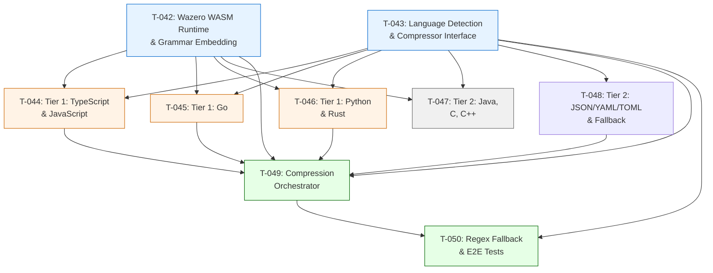

# Phase 5: Tree-Sitter Code Compression -- Task Index

## Overview

This index covers the AST-based code compression engine for Harvx (PRD Section 5.6). The compression subsystem uses tree-sitter grammars executed as WebAssembly modules via the wazero runtime (pure Go, zero CGO) to extract structural signatures from source files, achieving 50-70% token reduction while preserving code architecture.

**Total Tasks:** 9
**Estimated Total Effort:** 75-100 person-hours (approximately 10-13 person-days)
**Critical Path Length:** 5 tasks (T-042 -> T-043 -> T-044/T-045/T-046 -> T-049 -> T-050)

## Task Summary

| ID | Title | Priority | Effort | Dependencies | Status |
|----|-------|----------|--------|--------------|--------|
| [T-042](T-042-wazero-wasm-runtime-setup.md) | Wazero WASM Runtime Setup and Grammar Embedding | Must Have | Medium (8-12hrs) | None | -- |
| [T-043](T-043-language-detection-compressor-interface.md) | Language Detection and LanguageCompressor Interface | Must Have | Small (3-4hrs) | None | -- |
| [T-044](T-044-tier1-ts-js-compressor.md) | Tier 1 Compressor: TypeScript and JavaScript | Must Have | Large (16-20hrs) | T-042, T-043 | -- |
| [T-045](T-045-tier1-go-compressor.md) | Tier 1 Compressor: Go | Must Have | Medium (8-12hrs) | T-042, T-043 | -- |
| [T-046](T-046-tier1-python-rust-compressor.md) | Tier 1 Compressor: Python and Rust | Must Have | Large (14-18hrs) | T-042, T-043 | -- |
| [T-047](T-047-tier2-java-c-cpp-compressor.md) | Tier 2 Compressor: Java, C, and C++ | Should Have | Medium (10-14hrs) | T-042, T-043 | -- |
| [T-048](T-048-tier2-config-compressor-fallback.md) | Tier 2 Config Compressors (JSON/YAML/TOML) and Fallback | Must Have | Small (4-6hrs) | T-043 | -- |
| [T-049](T-049-compression-orchestrator.md) | Compression Orchestrator and Pipeline Integration | Must Have | Medium (10-14hrs) | T-042, T-043, T-044, T-045, T-046, T-048 | -- |
| [T-050](T-050-regex-fallback-compression-tests.md) | Regex Heuristic Fallback and E2E Compression Tests | Must Have | Medium (10-14hrs) | T-043, T-049 | -- |

## Dependency Graph

## Suggested Implementation Order

### Week 1: Foundation (Parallel Tracks)

**Track A: WASM Infrastructure**
- [ ] **T-042**: Wazero WASM Runtime Setup and Grammar Embedding
  - Set up wazero runtime
  - Download/build tree-sitter grammar .wasm files for all languages
  - Implement GrammarRegistry with lazy loading and caching
  - Evaluate malivvan/tree-sitter vs direct wazero approach

**Track B: Interface Design (can start immediately, no WASM dependency)**
- [ ] **T-043**: Language Detection and LanguageCompressor Interface
  - Define LanguageCompressor interface, Signature types, CompressedOutput
  - Implement extension-to-language mapping
  - Build CompressorRegistry

**Track C: Config Compressors (can start after T-043)**
- [ ] **T-048**: Tier 2 Config Compressors and Fallback
  - JSON, YAML, TOML compressors (no WASM needed)
  - Fallback compressor for unsupported languages

### Week 2: Tier 1 Language Compressors (Parallel after T-042 + T-043)

These three tasks can be implemented in parallel by different developers:

- [ ] **T-044**: TypeScript and JavaScript Compressor (most complex, start first)
- [ ] **T-045**: Go Compressor
- [ ] **T-046**: Python and Rust Compressor

### Week 3: Integration and Hardening

- [ ] **T-047**: Tier 2 Java, C, C++ Compressors (can overlap with Week 2)
- [ ] **T-049**: Compression Orchestrator and Pipeline Integration
  - Wire everything together
  - Integrate with CLI flags and profile settings
  - Parallel compression with errgroup
  - Timeout enforcement
- [ ] **T-050**: Regex Heuristic Fallback and E2E Tests
  - Build regex fallback engine
  - Comprehensive golden test suite
  - Faithfulness verification
  - Performance benchmarks

## Technical Stack Summary

| Component | Technology | Version | Purpose |
|-----------|-----------|---------|---------|
| WASM Runtime | tetratelabs/wazero | ^1.8.0 | Pure Go WebAssembly execution |
| (Alternative) | malivvan/tree-sitter | latest | Higher-level tree-sitter+wazero wrapper |
| Tree-sitter Grammars | Various tree-sitter repos | Latest WASM builds | Language-specific parsers |
| JSON Parsing | encoding/json (stdlib) | Go stdlib | JSON config compression |
| TOML Parsing | BurntSushi/toml | Latest | TOML config compression |
| Concurrency | x/sync/errgroup | Latest | Parallel compression |
| Embedding | embed (stdlib) | Go 1.16+ | Grammar WASM embedding |

## Research Findings

### Key Technical Decisions

1. **wazero vs. malivvan/tree-sitter**: The `malivvan/tree-sitter` library (published January 2025) wraps tree-sitter WASM with wazero and provides a higher-level Go API. It eliminates the need to write low-level WASM interop code. However, it is pre-release software. The implementation should evaluate both approaches and document the decision in an ADR.

2. **Grammar WASM file sizes**: Each grammar .wasm file embeds the full tree-sitter runtime (~250KB overhead). Total estimated embedding size for all languages: 3-8MB. This is within the PRD's 20MB binary target.

3. **Lazy grammar loading**: Grammar modules are compiled on first use, not at startup. This means the WASM overhead is only incurred when `--compress` is active and only for languages actually encountered.

4. **Regex fallback**: The PRD explicitly calls for a regex heuristic fallback if WASM proves inadequate. The implementation uses an `auto` engine mode that tries WASM first and falls back to regex per-file.

5. **Config file compression**: JSON, YAML, and TOML compressors do NOT use tree-sitter WASM. They use native Go parsing for simplicity and reliability.

### Deviations from PRD

- None. All PRD requirements for Section 5.6 are covered across T-042 through T-050.

### Risks

| Risk | Probability | Impact | Mitigation |
|------|-------------|--------|------------|
| malivvan/tree-sitter API instability | Medium | Medium | Pin to specific tag; maintain ability to switch to direct wazero |
| WASM grammar parsing gaps | Medium | Low | Regex fallback (T-050) handles gaps; golden tests catch regressions |
| Binary size exceeds 20MB target | Low | Low | Compress .wasm files before embedding; evaluate lazy-loading from companion archive |
| TypeScript grammar complexity | Medium | Medium | TypeScript compressor (T-044) allocated the most effort; has comprehensive edge case coverage |
| Parallel compression race conditions | Low | High | Stateless compressor design; atomic stat counters; comprehensive concurrency tests |

## Pipeline Integration Notes

The compression subsystem integrates into the Harvx processing pipeline between content loading/redaction and token counting. Key integration points with other phases:

- **Phase 1 (Foundation)**: Depends on `FileDescriptor` type from `internal/pipeline/types.go`
- **Phase 1 (Foundation)**: Depends on `errgroup` concurrency pattern from file discovery
- **Phase 2 (Intelligence)**: Token counting runs on compressed content (not original)
- **Phase 2 (Intelligence)**: Budget filtering happens BEFORE compression (lazy loading)
- **Phase 3 (Security)**: Redaction runs BEFORE compression (compressed output is already redacted)

---

_Last updated: 2026-02-16_