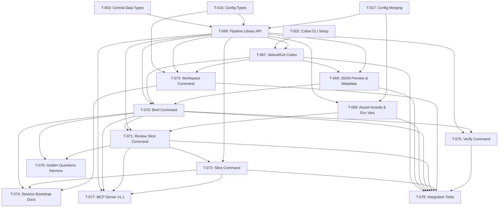

# Phase 8: Workflows - Task Index

## Overview

Phase 5 implements first-class workflow support for Harvx, transforming it from a general-purpose context generator into a core component of automated AI code review pipelines and coding agent bootstrap systems. This phase covers:

- **Pipeline Integration (PRD 5.10):** Core pipeline as a Go library, clean stdout mode, structured exit codes, JSON metadata output, environment variable overrides
- **Review Pipelines (PRD 5.11.1):** `harvx brief` (stable repo context) and `harvx review-slice` (PR-specific context with bounded neighborhood)
- **Session Bootstrap (PRD 5.11.2):** Claude Code hooks integration, lean CLAUDE.md template, `harvx slice --path` for on-demand context, MCP server
- **Workspace Manifest (PRD 5.11.3):** `.harvx/workspace.toml` config, `harvx workspace` command for multi-repo context
- **Output Quality (PRD 5.11.4):** `--assert-include` coverage checks, `harvx verify` faithfulness verification, golden questions harness

**Total Tasks:** 13
**Estimated Total Effort:** 116-180 hours (15-23 person-days)
**Critical Path Length:** 6 tasks (T-066 -> T-067 -> T-068 -> T-070 -> T-071 -> T-078)

## Task Summary

| ID    | Title                                      | Priority     | Effort           | Dependencies                    | Status |
|-------|--------------------------------------------|--------------|------------------|---------------------------------|--------|
| T-066 | Core Pipeline as Go Library API            | Must Have    | Large (14-20hrs) | T-003, T-016, T-017            | --     |
| T-067 | Stdout Mode, Exit Codes, Non-Interactive   | Must Have    | Medium (6-10hrs) | T-066, T-002                   | --     |
| T-068 | JSON Preview Output and Metadata Sidecar   | Must Have    | Medium (8-12hrs) | T-066, T-067                   | --     |
| T-069 | Assert-Include and Environment Overrides   | Must Have    | Medium (6-10hrs) | T-066, T-017                   | --     |
| T-070 | Repo Brief Command (`harvx brief`)         | Must Have    | Large (14-20hrs) | T-066, T-067, T-068            | --     |
| T-071 | Review Slice Command (`harvx review-slice`)| Must Have    | Large (16-24hrs) | T-066, T-070, T-069            | --     |
| T-072 | Module Slice Command (`harvx slice`)       | Must Have    | Medium (8-12hrs) | T-066, T-071                   | --     |
| T-073 | Workspace Manifest and Command             | Must Have    | Medium (10-14hrs)| T-016, T-066, T-067            | --     |
| T-074 | Session Bootstrap Docs and Hooks           | Must Have    | Medium (6-10hrs) | T-070, T-072, T-073            | --     |
| T-075 | Verify Command (Faithfulness Checking)     | Must Have    | Medium (8-12hrs) | T-066, T-070                   | --     |
| T-076 | Golden Questions Harness                   | Should Have  | Medium (8-12hrs) | T-070, T-071                   | --     |
| T-077 | MCP Server v1.1 (`harvx mcp serve`)       | Nice to Have | Large (16-24hrs) | T-066, T-070, T-071, T-072     | --     |
| T-078 | Workflow Integration Tests (E2E)           | Must Have    | Medium (10-14hrs)| T-067-T-073, T-075             | --     |

## Dependency Graph

## Suggested Implementation Order

### Wave 1: Foundation (Days 1-3)

These tasks have no intra-phase dependencies and establish the architecture for all workflow commands.

- [ ] **T-066**: Core Pipeline as Go Library API -- the architectural keystone
- [ ] **T-069**: Assert-Include and Environment Overrides -- can be built in parallel with T-067

### Wave 2: Pipeline Behavior (Days 3-5)

These depend on T-066 and establish the CLI behavior patterns used by all commands.

- [ ] **T-067**: Stdout Mode, Exit Codes, Non-Interactive Defaults
- [ ] **T-068**: JSON Preview Output and Metadata Sidecar

### Wave 3: Core Workflow Commands (Days 5-10)

The heart of Phase 5 -- the workflow commands that orchestrate the pipeline.

- [ ] **T-070**: Repo Brief Command (depends on T-066, T-067, T-068)
- [ ] **T-073**: Workspace Manifest and Command (can be built in parallel with T-070)
- [ ] **T-071**: Review Slice Command (depends on T-070 for shared patterns)
- [ ] **T-072**: Module Slice Command (depends on T-071 for neighbor logic)

### Wave 4: Quality and Documentation (Days 10-13)

Verification, documentation, and quality evaluation tooling.

- [ ] **T-075**: Verify Command (depends on T-066, T-070)
- [ ] **T-074**: Session Bootstrap Documentation (depends on T-070, T-072, T-073)
- [ ] **T-076**: Golden Questions Harness (Should Have; depends on T-070, T-071)

### Wave 5: Integration and MCP (Days 13-16)

End-to-end validation and the optional MCP server.

- [ ] **T-078**: Workflow Integration Tests (depends on all Must Have tasks)
- [ ] **T-077**: MCP Server v1.1 (Nice to Have; depends on T-066, T-070, T-071, T-072)

## Technical Stack Summary

| Component | Technology | Version | Purpose |
|-----------|-----------|---------|---------|
| CLI Framework | spf13/cobra | latest | Subcommand registration (brief, review-slice, slice, workspace, verify, mcp) |
| Config Parsing | BurntSushi/toml | v1.5.0 | Workspace.toml and golden-questions.toml parsing |
| Config Merging | knadh/koanf/v2 | latest | HARVX_ environment variable overrides |
| Glob Matching | bmatcuk/doublestar/v4 | latest | Assert-include pattern matching |
| Content Hashing | cespare/xxhash | latest | XXH3 for deterministic content hashes |
| JSON Output | encoding/json (stdlib) | Go 1.24 | Preview --json, metadata sidecar, MCP responses |
| Git Operations | os/exec (stdlib) | Go 1.24 | Shell out to git for diff, ref validation |
| Logging | log/slog (stdlib) | Go 1.24 | Structured logging to stderr |
| MCP Protocol | modelcontextprotocol/go-sdk | latest | MCP server implementation (T-077 only) |
| Testing | stretchr/testify | latest | Assertions and test suites |

## Research Findings

### Claude Code Hooks (SessionStart)
- Claude Code supports `SessionStart` hooks that run on every new or resumed session
- Hook stdout is injected as conversation context automatically
- Hook config goes in `.claude/hooks.json` (project) or `~/.claude/hooks.json` (global)
- Performance is critical: hooks should complete in under 5 seconds
- Reference: https://code.claude.com/docs/en/hooks

### MCP Go SDK
- The official Go SDK is `github.com/modelcontextprotocol/go-sdk` (maintained with Google)
- Current specification version: 2025-11-25
- Uses typed tool handlers with generic `mcp.AddTool()` function
- Stdio transport is standard for local MCP servers
- Community alternative `mark3labs/mcp-go` also implements the full spec
- Reference: https://github.com/modelcontextprotocol/go-sdk

### Key Architecture Decision
The PRD mandates designing the core pipeline as a Go library (not just CLI glue). This is the critical enabler for Phase 5: all workflow commands (brief, review-slice, slice, workspace) and the MCP server must invoke the same pipeline engine programmatically. T-066 establishes this architecture.

## PRD Section Mapping

| PRD Section | Tasks |
|-------------|-------|
| 5.10 Multi-Agent Pipeline Integration | T-066, T-067, T-068, T-069 |
| 5.11.1 Review Pipelines | T-070, T-071 |
| 5.11.2 Session Bootstrap | T-072, T-074, T-077 |
| 5.11.3 Workspace Manifest | T-073 |
| 5.11.4 Output Quality Evaluation | T-069, T-075, T-076, T-068 |

---

_Generated: 2026-02-16_